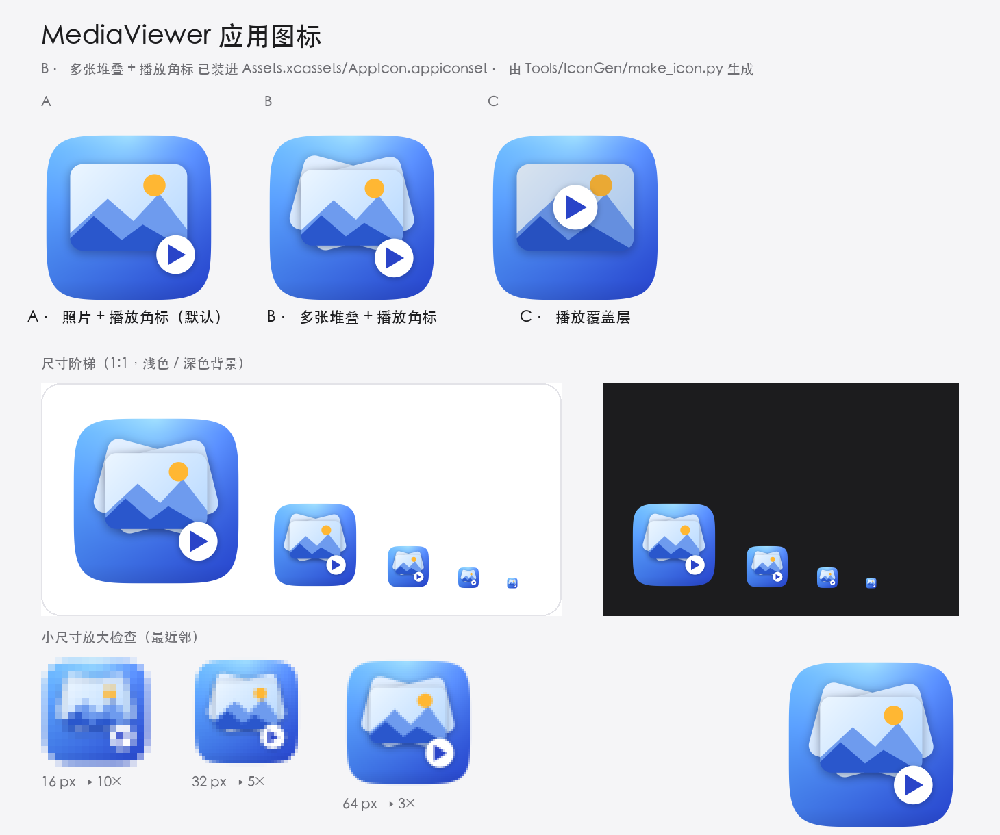

# MediaViewer

macOS 上用来快速翻看图片和视频的小工具，SwiftUI 原生实现。


## 功能

1. **预览与播放**
   - 图片：适应窗口显示，双指缩放 / 触控板捏合、双击在「适应窗口」和「100%」之间切换，右下角有缩放控件。
   - 视频：AVKit 播放器，自带播放/暂停、进度条、逐帧、全屏、画中画；打开时停在开头并渲染首帧。
2. **同文件夹内上/下一个导航**
   - 打开文件夹后按**文件名自然排序**（`img-2` 排在 `img-10` 前面），只列出图片和视频，忽略隐藏文件和子目录。
   - 单独打开一个文件（`⌘O` 选文件、命令行传路径、Finder「打开方式」）时，会打开它所在的文件夹并直接选中它，接着就能上下翻看同目录的其他素材。
   - 工具栏的 `‹` `›` 按钮、菜单「浏览」、快捷键 `⌘←` / `⌘→` 都可以翻看；底部状态栏显示 `第几个 / 共几个`。
3. **查看元数据**
   - 右侧面板（`⌘I` 显示/隐藏）分组展示：
     - 图片：文件信息、尺寸/色彩（像素、宽高比、位深、DPI、颜色配置文件）、拍摄设备（厂商/机型/镜头/软件）、拍摄参数（光圈、快门、ISO、焦距、35mm 等效、曝光补偿、测光、闪光灯、白平衡…）、GPS（经纬度、海拔、GPS 时间）、IPTC/PNG 说明文字、其他未单独映射的 EXIF 项。
     - 视频：时长、分辨率、帧率、总码率、视频轨（编码、编码尺寸、色彩原色/传输函数、位深）、音频轨（编码、采样率、声道数、位深）、容器元数据（标题、作者、创建时间等）。
   - 面板顶部可以「拷贝」全部元数据为文本，或用「访达」定位文件。

## 环境要求

- macOS 14.0 或更高（开发机为 macOS 26.5）
- Xcode 16 或更高（本仓库用 Xcode 26.6 / Swift 6.3.3 验证过）

## 构建与运行

```bash
# 命令行构建（产物在 .build/DerivedData/Build/Products/Debug/MediaViewer.app）
./scripts/build.sh              # 或 ./scripts/build.sh Release

# 构建并启动，可以带一个要打开的文件夹或媒体文件
./scripts/run.sh
./scripts/run.sh ~/Pictures
./scripts/run.sh ~/Pictures/DSC_0001.NEF
```

也可以直接用 Xcode 打开 `MediaViewer.xcodeproj` 后 Run（scheme 已经共享）。

命令行启动时支持把文件夹或单个媒体文件作为参数传入，方便脚本和自动化测试：

```bash
.build/DerivedData/Build/Products/Debug/MediaViewer.app/Contents/MacOS/MediaViewer ~/Pictures
.build/DerivedData/Build/Products/Debug/MediaViewer.app/Contents/MacOS/MediaViewer ~/Pictures/DSC_0001.NEF
```

## 在 Finder 里打开（右键「打开方式」）

App 在 [Config/Info.plist](Config/Info.plist) 里用 `CFBundleDocumentTypes` 声明了自己能处理的媒体类型（UTI），
装好并运行过一次之后：

- 右键任意图片 / 视频 →「打开方式」里有 **MediaViewer**；
- 「显示简介 → 打开方式」可以把它设成某类文件的默认程序；声明里用 `LSHandlerRank = Alternate`，所以它只当备选，不会抢「预览」「QuickTime Player」的位置；
- 双击（设成默认之后）、拖到 Dock 图标、`open -a MediaViewer <文件>` 都会以 LaunchServices 的「打开文稿」事件进入 App：打开文件所在文件夹并选中该文件；
- `MediaViewer --dump-state <输出文件> <文件夹或文件>` 可以不开窗口地验证这条链路。

注册信息由 LaunchServices 扫描 App 得到，**换新版本或换位置后要让它重新扫一遍**：

```bash
LSREGISTER=/System/Library/Frameworks/CoreServices.framework/Versions/Current/Frameworks/LaunchServices.framework/Versions/Current/Support/lsregister

# 覆盖安装到 /Applications 之后
"$LSREGISTER" -f /Applications/MediaViewer.app

# 把某个旧拷贝（比如直接从 DMG 里运行过的那份）从注册表里删掉，否则它可能赢过新拷贝
"$LSREGISTER" -u "/Volumes/MediaViewer 1.0/MediaViewer.app"
```

`xcodebuild` 每次构建完会自动对本地产物跑一次 `lsregister -f -trusted`，所以直接跑 `.build/DerivedData/Build/Products/Debug/MediaViewer.app` 时就已经注册好了。
想用命令行改默认程序可以装 [duti](https://github.com/jwalton/duti)：`duti -s com.hohband.MediaViewer public.jpeg all`。

`./scripts/verify-handler.sh` 为了验证会临时注册 `.build` 里的构建产物；跑完如果发现 `/Applications/MediaViewer.app` 存在，就把注册指回安装版（构建产物从注册表里移除），避免同一个 bundle id 的两份拷贝打架。

声明里列的类型（`LSItemContentTypes`）要和 [MediaItem.swift](MediaViewer/Models/MediaItem.swift) 的扩展名白名单一起改，
否则会出现「右键菜单里有 MediaViewer，打开却说格式不支持」。

## 打包分发

```bash
./scripts/package.sh
```

产物在 `dist/`（已 gitignore；版本号取自工程里的 `MARKETING_VERSION`）：

| 文件 | 用途 |
| --- | --- |
| `MediaViewer-1.0.dmg` | 标准安装包：打开后把 App 拖进 Applications |
| `MediaViewer-1.0.pkg` | 双击安装，自动装到 `/Applications`（适合批量部署 / MDM） |
| `MediaViewer-1.0.zip` | 解压即用，适合挂 GitHub Release |

脚本流程：Release **通用二进制**（arm64 + x86_64）→ 校验签名 → 检查 `Info.plist` 里确实有给 Finder 用的文稿类型声明 → 打出三种包 → **逐个验证包里的 App 真的能跑**（用 App 自带的 `--dump-state` 打开只放了一张图的临时文件夹，断言加载到 1 个文件且就是 `screenshot.png`；DMG 还检查 `Applications` 链接和 `codesign --verify --strict`）→ 打印 SHA-256。

实测产物（本机）：

```
1.2M  MediaViewer-1.0.dmg   checksum VALID
1.1M  MediaViewer-1.0.pkg   载荷 25 个条目
1.1M  MediaViewer-1.0.zip
```

### 签名与公证

默认是 **ad-hoc 签名**（`codesign` 显示 `Signature=adhoc`），因为这台机器上没有任何开发者证书（`security find-identity -v -p codesigning` 为 0 valid identities）。于是：

- 本机可以直接运行；
- 拷到别的 Mac 会被 Gatekeeper 拦（“无法验证开发者”）。对方可以右键 App 选「打开」，或者执行 `xattr -dr com.apple.quarantine /Applications/MediaViewer.app`。

要出正式分发包，需要 Apple 开发者账号里的 **Developer ID Application** 证书：

```bash
SIGN_IDENTITY="Developer ID Application: Your Name (TEAMID)" \
NOTARY_PROFILE="notary" \
./scripts/package.sh
```

`NOTARY_PROFILE` 是 `xcrun notarytool store-credentials` 存好的 keychain profile，给了它脚本就会在打包后提交公证。

### 打包时的两个坑

- 不用 `hdiutil create -srcfolder`：它内部要先挂载一个临时镜像，在沙箱 / CI 这类受限环境里会以 `目录非空` 失败。改成 `makehybrid`（直接构建 HFS+ 文件系统，不挂载）→ 在可写镜像里清掉 `makehybrid` 附带的 `com.apple.FinderInfo`（不清的话 `codesign --strict` 会报 `resource fork, Finder information, or similar detritus not allowed`）→ 压成只读 UDZO。
- `pkgutil --expand-full` 的目标目录必须不存在，否则直接失败。

## 应用图标



图标是**代码画出来的**（`Tools/IconGen/make_icon.py`，Pillow + numpy），仓库里没有二进制设计稿：
蓝色渐变底 + 扇形展开的三张照片（最前面那张有远山、近山和太阳）+ 右下角播放角标，
一个符号里同时有「一堆可以翻看的照片」和「能播放的视频」。

```bash
python3 Tools/IconGen/make_icon.py                        # 重新生成 docs/icon-preview.png
python3 Tools/IconGen/make_icon.py --install              # 同时写入 AppIcon.appiconset
python3 Tools/IconGen/make_icon.py --variant a --install  # 换变体（A/B/C，见预览图）
```

三个变体（**当前装的是 B**）：**A** 单张照片 + 角标，元素最少、最小尺寸下最直接；
**B** 多张堆叠 + 角标，强调「同一个文件夹里前后翻看」（前面那张小一点，给扇形的两张让位）；
**C** 播放角标压在照片正中，强调视频。
`--install` 会一次写出 10 档 PNG（16 / 32 / 64 / 128 / 256 / 512 / 1024，含 @2x）并同步 `Contents.json`。

几何与取舍：

- 主体占画布 **94%**（四周留 3%），圆角半径取主体边长的 **22.37%**，用超椭圆（指数 5）近似 Apple 的连续圆角。
  留白比 Xcode 模板的 10% 小，是因为 macOS 26 会把超出规格的图标缩小后塞进圆角灰底
  （[Tahoe 的图标形状处理](https://www.heise.de/en/news/Icons-in-macOS-26-Fighting-the-Squircle-Prison-11075561.html)），
  按 80% 画会被再收一次；94% 在 macOS 14/15 上只是略饱满一点，在 26 上不会被缩。
- 降采样按**预乘 alpha 做面积平均**（`RENDER=3072` 是各档的公倍数，除得尽），否则透明区的黑色会被插值进边缘，16px 上是一圈暗边。

## 快捷键

| 操作 | 快捷键 |
| --- | --- |
| 打开文件 / 文件夹 | `⌘O` |
| 上一个 / 下一个 | `⌘←` / `⌘→` |
| 重新载入当前文件夹 | `⌘R` |
| 显示 / 隐藏元数据面板 | `⌘I` |
| 图片：适应窗口 ↔ 100% | 双击图片 |
| 图片：缩放 | 触控板捏合，或右下角 `−` `+` |

## 支持的格式

- 图片：`jpg` `jpeg` `png` `gif` `heic` `heif` `tif` `tiff` `bmp` `webp` `avif` `jp2`，以及常见 RAW（`dng` `cr2` `cr3` `nef` `arw` `orf` `raf` `rw2` `srw` `pef`）。
- 视频：`mov` `qt` `mp4` `m4v` `avi` `mpg` `mpeg` `mpe` `m2v` `ts` `m2ts` `mts` `3gp` `3g2` `dv`。

解码走系统能力（图片 ImageIO、视频 AVFoundation），所以能播的就是系统能播的；遇到系统不支持的容器或编码，播放器会给出明确提示而不是静默黑屏。要增删格式，改 [MediaItem.swift](MediaViewer/Models/MediaItem.swift) 里的两个扩展名集合即可；同时记得同步 [Config/Info.plist](Config/Info.plist) 里给 Finder 用的 UTI 列表（见上文「在 Finder 里打开」）。

## 目录结构

```
MediaViewer.xcodeproj/          手写的 Xcode 工程（objectVersion 77 + 文件系统同步分组）
Config/Info.plist               只放 CFBundleDocumentTypes：声明 Finder / LaunchServices 用的文稿类型
MediaViewer/
  MediaViewerApp.swift          入口、菜单命令、LaunchServices 打开事件的 AppDelegate
  Models/MediaItem.swift        媒体类型与支持的扩展名
  Services/
    MediaScanner.swift          文件夹扫描 + 自然排序（纯逻辑）
    MediaLibrary.swift          当前文件夹 / 当前选中项 / 上一个下一个 / 打开文件或文件夹
    MetadataReader.swift        ImageIO + AVFoundation 读元数据
    MetadataFormat.swift        数值展示格式化
    MetadataModels.swift        元数据分组模型
    OpenRequests.swift          Finder「打开方式」请求的队列
    MediaViewerDiagnostics.swift --dump-state 诊断入口
  Views/                        预览区、缩放图片、视频播放器、元数据面板、空状态
  Assets.xcassets               应用图标（AppIcon.appiconset 由脚本生成）
Tools/
  IconGen/                      图标生成脚本：图标即代码（Pillow + numpy）
  MetadataProbe/                命令行探针：跑同一份扫描/元数据实现
  WindowProbe/                  窗口信息与截图像素统计（UI 冒烟用）
  HandlerProbe/                 查询系统认为能打开某文件的 App（处理程序验证用）
scripts/                        构建、运行、打包、验证脚本
docs/screenshot.png             README 截图
docs/icon-preview.png           图标预览：变体对比 + 尺寸阶梯 + 明暗背景
```

## 验证

仓库里有三套可重复运行的验证，`./scripts/verify.sh` 一次跑完：

```bash
./scripts/verify-metadata.sh    # 数据链路
./scripts/ui-smoke.sh           # 界面链路（需要「屏幕录制」权限）
./scripts/verify-handler.sh     # Finder「打开方式」链路
./scripts/package.sh            # 打 DMG / PKG / ZIP 安装包
```

**1. 元数据链路（`verify-metadata.sh`）**

用 ffmpeg 生成样例，再用 Python 手写 TIFF/EXIF 字节注入一个已知的 EXIF + GPS（不借助 ImageIO 回写，避免读写同一套实现导致假通过），然后：

- 编译 `Tools/MetadataProbe`，直接复用 App 里的 `MediaScanner` / `MetadataReader`，断言扫描结果、自然排序、EXIF（厂商/机型/镜头/软件/时间/光圈/快门/ISO/焦距）、GPS（37.7749 / -122.4194 / 12.5 米）、视频（分辨率、时长、H.264、AAC、标题）。
- 交叉验证：用系统自带的 `sips` 独立读取 EXIF、用 `ffprobe` 独立读取容器元数据，断言值与注入值一致。

**2. 界面链路（`ui-smoke.sh`）**

真的把编译好的 App 起来（传入只含一个文件的文件夹），检查：

- 窗口存在且标题等于当前文件名（说明文件夹加载、首个文件选中、`navigationTitle` 生效）；
- 用 `screencapture -R` 按窗口矩形截图，用 `Tools/WindowProbe` 统计像素：预览区彩色像素比例 ≥ 50%（图片）/ ≥ 30%（视频）且颜色数 ≥ 20 —— 证明画面**真的画出来了**，不是空白；
- 元数据面板区域有深色文字像素且背景是浅色 —— 证明面板渲染了内容。

当前两个用例的实测：

```
用例 ui-image: 标题 img-1.jpg  预览区 colors=878 colorful=99.6%
用例 ui-video: 标题 vid-1.mp4  预览区 colors=850 colorful=99.8%
```

`ui-smoke.sh` 需要给终端「屏幕录制」权限；没有权限时脚本会明确报错退出，不会假装通过。

**3. Finder 处理程序链路（`verify-handler.sh`）**

不靠人工点右键，直接问 LaunchServices 要答案：

- 构建产物的 `Contents/Info.plist` 里确实有 `CFBundleDocumentTypes`，且包含 `public.jpeg` / `public.png` / `public.heic` / `com.apple.quicktime-movie` / `public.mpeg-4`；
- `lsregister -f` 之后，用 `Tools/HandlerProbe`（`NSWorkspace.urlsForApplications(toOpen:)`）确认这些类型**候选 App 列表里有本 App**——这正是 Finder 右键菜单的数据来源；
- 最后真的用 LaunchServices 打开 `img-1.jpg` / `vid-1.mp4`（等价于双击 / 右键「打开方式」），断言窗口标题变成对应文件名。

实测输出：

```
✅ img-1.jpg：候选里有 MediaViewer（系统默认：/System/Applications/Preview.app）
✅ vid-1.mp4：候选里有 MediaViewer（系统默认：/System/Applications/QuickTime Player.app）
✅ .build/samples/img-1.jpg → 窗口标题 img-1.jpg
```

**还没有自动覆盖的部分**：鼠标点击工具栏按钮、菜单项、拖拽打开、键盘翻页这些交互，以及缩放到某个具体比例后的像素结果。仓库暂时没有 XCTest target——核心逻辑用命令行探针覆盖，UI 用截图覆盖。

## 实现说明与取舍

- **不用 `@Observable`，用 `ObservableObject`**：`@Observable` 依赖 Swift 宏插件（`swift-plugin-server`），在受限的构建环境里会直接失败。`ObservableObject` 没有这个问题，行为一致。
- **视频不用 SwiftUI 的 `VideoPlayer`**：它只链接 `_AVKit_SwiftUI` 这个 overlay，在 macOS 26 上运行时会因为找不到 AVKit 的 `AVPlayerView` 类而 `failed to demangle superclass of VideoPlayerView` 并 abort。现在的做法是自己用 `NSViewRepresentable` 包一层 `AVPlayerView`，并在工程里显式链接 `AVKit.framework`。
- **没有开启 App Sandbox**：这样可以打开任意目录、读取任意文件。代价是不能上架 Mac App Store；要上架需要打开沙盒并改用安全作用域书签（security-scoped bookmarks）保存目录授权。
- **Info.plist 只写一半**：文稿类型（`CFBundleDocumentTypes`）没法用 `INFOPLIST_KEY_*` 表达（数组键不支持），所以留了一份手写的 [Config/Info.plist](Config/Info.plist)，和 Xcode 的 `GENERATE_INFOPLIST_FILE` 在构建时合并。它特意放在 `MediaViewer/` 之外——那个目录是 `PBXFileSystemSynchronizedRootGroup`，放在里面的 `Info.plist` 会被当成资源再拷一份进 `Contents/Resources/`。
- **`LSHandlerRank = Alternate` + `CFBundleTypeRole = Viewer`**：本 App 只读不写，所以不抢「预览」「QuickTime Player」的默认位置，只在右键「打开方式」里当备选；`verify-handler.sh` 会把系统当前的默认程序一起打印出来（断言的是「候选里有 MediaViewer」，不是「抢到了默认」）。
- **打开事件用 AppDelegate 而不是只靠 `.onOpenURL`**：SwiftUI 的 `.onOpenURL` 在「App 没运行 + 双击文件」这条路径上不保证收到，`NSApplicationDelegate.application(_:open:)` 更可靠；两者都汇到 `OpenRequests` 队列，界面起来再取走。
- **Swift 5 语言模式**：工程 `SWIFT_VERSION = 5.0`，避免严格并发检查在 SwiftUI + AVFoundation 组合上产生大量噪音。
- **元数据不依赖外部工具**：不需要 exiftool/ffprobe，全部走系统框架，App 分发时没有额外依赖（脚本里的 ffmpeg/ffprobe 只用于生成和交叉验证样例）。
- **手写 pbxproj**：工程文件是手写的（`objectVersion = 77` + `PBXFileSystemSynchronizedRootGroup`），所以 `MediaViewer/` 目录下新增 Swift 文件会自动进入 target，不需要改工程文件（`Config/` 不在同步范围内，改动它要显式写进工程）。

## 可能想接着做的

- 左侧缩略图列表 / 幻灯片播放 / 空格快速预览；
- 记住上次打开的文件夹、按拍摄时间排序、收藏与评分；
- 图片旋转、裁剪、导出；
- Live Photo 与 RAW 的更好支持；
- 给「最近打开」和文件拖拽加上处理；
- 「设为默认打开程序」的一键菜单项（自己在 `LSItemContentTypes` 里挑类型调 `LSSetDefaultRoleHandlerForContentType`）。

## 仓库

`git@github.com:hohband/MediaViewer.git`
