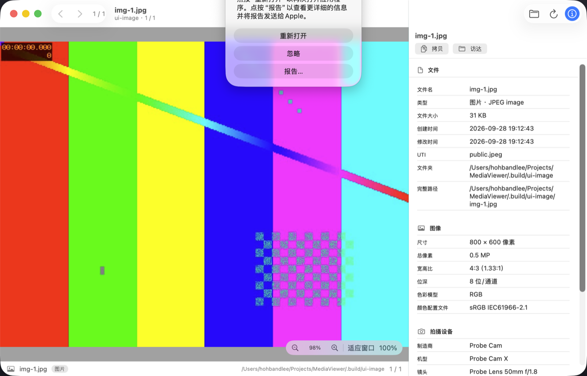

# MediaViewer

macOS 上用来快速翻看图片和视频的小工具，SwiftUI 原生实现。



## 功能

1. **预览与播放**
   - 图片：适应窗口显示，双指缩放 / 触控板捏合、双击在「适应窗口」和「100%」之间切换，右下角有缩放控件。
   - 视频：AVKit 播放器，自带播放/暂停、进度条、逐帧、全屏、画中画；打开时停在开头并渲染首帧。
2. **同文件夹内上/下一个导航**
   - 打开文件夹后按**文件名自然排序**（`img-2` 排在 `img-10` 前面），只列出图片和视频，忽略隐藏文件和子目录。
   - 工具栏的 `‹` `›` 按钮、菜单「浏览」、快捷键 `⌘←` / `⌘→` 都可以翻看；底部状态栏显示 `第几个 / 共几个`。
3. **查看元数据**
   - 右侧面板（`⌘I` 显示/隐藏）分组展示：
     - 图片：文件信息、尺寸/色彩（像素、宽高比、位深、DPI、颜色配置文件）、拍摄设备（厂商/机型/镜头/软件）、拍摄参数（光圈、快门、ISO、焦距、35mm 等效、曝光补偿、测光、闪光灯、白平衡…）、GPS（经纬度、海拔、GPS 时间）、IPTC/PNG 说明文字、其他未单独映射的 EXIF 项。
     - 视频：时长、分辨率、帧率、总码率、视频轨（编码、编码尺寸、色彩原色/传输函数、位深）、音频轨（编码、采样率、声道数、位深）、容器元数据（标题、作者、创建时间等）。
   - 面板顶部可以「拷贝」全部元数据为文本，或用「访达」定位文件。

## 环境要求

- macOS 14.0 或更高（开发机为 macOS 26.5）
- Xcode 16 或更高（本仓库用 Xcode 26.6 / Swift 6.3.3 验证过）

## 构建与运行

```bash
# 命令行构建（产物在 .build/DerivedData/Build/Products/Debug/MediaViewer.app）
./scripts/build.sh              # 或 ./scripts/build.sh Release

# 构建并启动，可以带一个要打开的文件夹
./scripts/run.sh
./scripts/run.sh ~/Pictures
```

也可以直接用 Xcode 打开 `MediaViewer.xcodeproj` 后 Run（scheme 已经共享）。

命令行启动时支持把文件夹作为参数传入，方便脚本和自动化测试：

```bash
.build/DerivedData/Build/Products/Debug/MediaViewer.app/Contents/MacOS/MediaViewer ~/Pictures
```

## 打包分发

```bash
./scripts/package.sh
```

产物在 `dist/`（已 gitignore；版本号取自工程里的 `MARKETING_VERSION`）：

| 文件 | 用途 |
| --- | --- |
| `MediaViewer-1.0.dmg` | 标准安装包：打开后把 App 拖进 Applications |
| `MediaViewer-1.0.pkg` | 双击安装，自动装到 `/Applications`（适合批量部署 / MDM） |
| `MediaViewer-1.0.zip` | 解压即用，适合挂 GitHub Release |

脚本流程：Release **通用二进制**（arm64 + x86_64）→ 校验签名 → 打出三种包 → **逐个验证包里的 App 真的能跑**（用 App 自带的 `--dump-state` 打开 `docs/`，断言加载到 1 个文件且首个是 `screenshot.png`；DMG 还检查 `Applications` 链接和 `codesign --verify --strict`）→ 打印 SHA-256。

实测产物（本机）：

```
540K  MediaViewer-1.0.dmg   checksum VALID
476K  MediaViewer-1.0.pkg   载荷 21 个条目
476K  MediaViewer-1.0.zip
```

### 签名与公证

默认是 **ad-hoc 签名**（`codesign` 显示 `Signature=adhoc`），因为这台机器上没有任何开发者证书（`security find-identity -v -p codesigning` 为 0 valid identities）。于是：

- 本机可以直接运行；
- 拷到别的 Mac 会被 Gatekeeper 拦（“无法验证开发者”）。对方可以右键 App 选「打开」，或者执行 `xattr -dr com.apple.quarantine /Applications/MediaViewer.app`。

要出正式分发包，需要 Apple 开发者账号里的 **Developer ID Application** 证书：

```bash
SIGN_IDENTITY="Developer ID Application: Your Name (TEAMID)" \
NOTARY_PROFILE="notary" \
./scripts/package.sh
```

`NOTARY_PROFILE` 是 `xcrun notarytool store-credentials` 存好的 keychain profile，给了它脚本就会在打包后提交公证。

### 打包时的两个坑

- 不用 `hdiutil create -srcfolder`：它内部要先挂载一个临时镜像，在沙箱 / CI 这类受限环境里会以 `目录非空` 失败。改成 `makehybrid`（直接构建 HFS+ 文件系统，不挂载）→ 在可写镜像里清掉 `makehybrid` 附带的 `com.apple.FinderInfo`（不清的话 `codesign --strict` 会报 `resource fork, Finder information, or similar detritus not allowed`）→ 压成只读 UDZO。
- `pkgutil --expand-full` 的目标目录必须不存在，否则直接失败。

## 快捷键

| 操作 | 快捷键 |
| --- | --- |
| 打开文件夹 | `⌘O` |
| 上一个 / 下一个 | `⌘←` / `⌘→` |
| 重新载入当前文件夹 | `⌘R` |
| 显示 / 隐藏元数据面板 | `⌘I` |
| 图片：适应窗口 ↔ 100% | 双击图片 |
| 图片：缩放 | 触控板捏合，或右下角 `−` `+` |

## 支持的格式

- 图片：`jpg` `jpeg` `png` `gif` `heic` `heif` `tif` `tiff` `bmp` `webp` `avif` `jp2`，以及常见 RAW（`dng` `cr2` `cr3` `nef` `arw` `orf` `raf` `rw2` `srw` `pef`）。
- 视频：`mov` `qt` `mp4` `m4v` `avi` `mpg` `mpeg` `mpe` `m2v` `ts` `m2ts` `mts` `3gp` `3g2` `dv`。

解码走系统能力（图片 ImageIO、视频 AVFoundation），所以能播的就是系统能播的；遇到系统不支持的容器或编码，播放器会给出明确提示而不是静默黑屏。要增删格式，改 [MediaItem.swift](MediaViewer/Models/MediaItem.swift) 里的两个扩展名集合即可。

## 目录结构

```
MediaViewer.xcodeproj/          手写的 Xcode 工程（objectVersion 77 + 文件系统同步分组）
MediaViewer/
  MediaViewerApp.swift          入口、菜单命令
  Models/MediaItem.swift        媒体类型与支持的扩展名
  Services/
    MediaScanner.swift          文件夹扫描 + 自然排序（纯逻辑）
    MediaLibrary.swift          当前文件夹 / 当前选中项 / 上一个下一个
    MetadataReader.swift        ImageIO + AVFoundation 读元数据
    MetadataFormat.swift        数值展示格式化
    MetadataModels.swift        元数据分组模型
    MediaViewerDiagnostics.swift --dump-state 诊断入口
  Views/                        预览区、缩放图片、视频播放器、元数据面板、空状态
  Assets.xcassets
Tools/
  MetadataProbe/                命令行探针：跑同一份扫描/元数据实现
  WindowProbe/                  窗口信息与截图像素统计（UI 冒烟用）
scripts/                        构建、运行、打包、验证脚本
docs/screenshot.png             README 截图
```

## 验证

仓库里有两套可重复运行的验证，`./scripts/verify.sh` 一次跑完：

```bash
./scripts/verify-metadata.sh    # 数据链路
./scripts/ui-smoke.sh           # 界面链路（需要「屏幕录制」权限）
./scripts/package.sh            # 打 DMG / PKG / ZIP 安装包
```

**1. 元数据链路（`verify-metadata.sh`）**

用 ffmpeg 生成样例，再用 Python 手写 TIFF/EXIF 字节注入一个已知的 EXIF + GPS（不借助 ImageIO 回写，避免读写同一套实现导致假通过），然后：

- 编译 `Tools/MetadataProbe`，直接复用 App 里的 `MediaScanner` / `MetadataReader`，断言扫描结果、自然排序、EXIF（厂商/机型/镜头/软件/时间/光圈/快门/ISO/焦距）、GPS（37.7749 / -122.4194 / 12.5 米）、视频（分辨率、时长、H.264、AAC、标题）。
- 交叉验证：用系统自带的 `sips` 独立读取 EXIF、用 `ffprobe` 独立读取容器元数据，断言值与注入值一致。

**2. 界面链路（`ui-smoke.sh`）**

真的把编译好的 App 起来（传入只含一个文件的文件夹），检查：

- 窗口存在且标题等于当前文件名（说明文件夹加载、首个文件选中、`navigationTitle` 生效）；
- 用 `screencapture -R` 按窗口矩形截图，用 `Tools/WindowProbe` 统计像素：预览区彩色像素比例 ≥ 50%（图片）/ ≥ 30%（视频）且颜色数 ≥ 20 —— 证明画面**真的画出来了**，不是空白；
- 元数据面板区域有深色文字像素且背景是浅色 —— 证明面板渲染了内容。

当前两个用例的实测：

```
用例 ui-image: 标题 img-1.jpg  预览区 colors=878 colorful=99.6%
用例 ui-video: 标题 vid-1.mp4  预览区 colors=850 colorful=99.8%
```

`ui-smoke.sh` 需要给终端「屏幕录制」权限；没有权限时脚本会明确报错退出，不会假装通过。

**还没有自动覆盖的部分**：鼠标点击工具栏按钮、菜单项、拖拽打开、键盘翻页这些交互，以及缩放到某个具体比例后的像素结果。仓库暂时没有 XCTest target——核心逻辑用命令行探针覆盖，UI 用截图覆盖。

## 实现说明与取舍

- **不用 `@Observable`，用 `ObservableObject`**：`@Observable` 依赖 Swift 宏插件（`swift-plugin-server`），在受限的构建环境里会直接失败。`ObservableObject` 没有这个问题，行为一致。
- **视频不用 SwiftUI 的 `VideoPlayer`**：它只链接 `_AVKit_SwiftUI` 这个 overlay，在 macOS 26 上运行时会因为找不到 AVKit 的 `AVPlayerView` 类而 `failed to demangle superclass of VideoPlayerView` 并 abort。现在的做法是自己用 `NSViewRepresentable` 包一层 `AVPlayerView`，并在工程里显式链接 `AVKit.framework`。
- **没有开启 App Sandbox**：这样可以打开任意目录、读取任意文件。代价是不能上架 Mac App Store；要上架需要打开沙盒并改用安全作用域书签（security-scoped bookmarks）保存目录授权。
- **Swift 5 语言模式**：工程 `SWIFT_VERSION = 5.0`，避免严格并发检查在 SwiftUI + AVFoundation 组合上产生大量噪音。
- **元数据不依赖外部工具**：不需要 exiftool/ffprobe，全部走系统框架，App 分发时没有额外依赖（脚本里的 ffmpeg/ffprobe 只用于生成和交叉验证样例）。
- **手写 pbxproj**：工程文件是手写的（`objectVersion = 77` + `PBXFileSystemSynchronizedRootGroup`），所以 `MediaViewer/` 目录下新增 Swift 文件会自动进入 target，不需要改工程文件。

## 可能想接着做的

- 左侧缩略图列表 / 幻灯片播放 / 空格快速预览；
- 记住上次打开的文件夹、按拍摄时间排序、收藏与评分；
- 图片旋转、裁剪、导出；
- Live Photo 与 RAW 的更好支持；
- 给「最近打开」和文件拖拽加上处理。

## 仓库

`git@github.com:hohband/MediaViewer.git`
